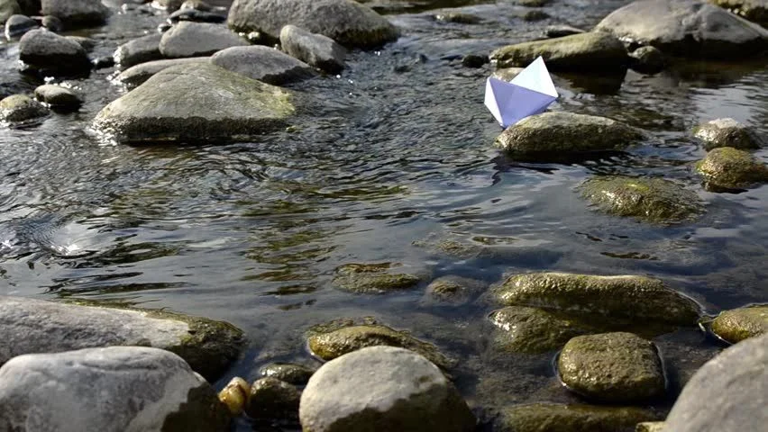

# This python project attempts to make cool animations with matplotlib and numPy
---

I shall attempt two challenges.

1. Animating a firework (Normal)
2. Animating a wave (Hard)

## Firework attempt 🧨

First milestone:

